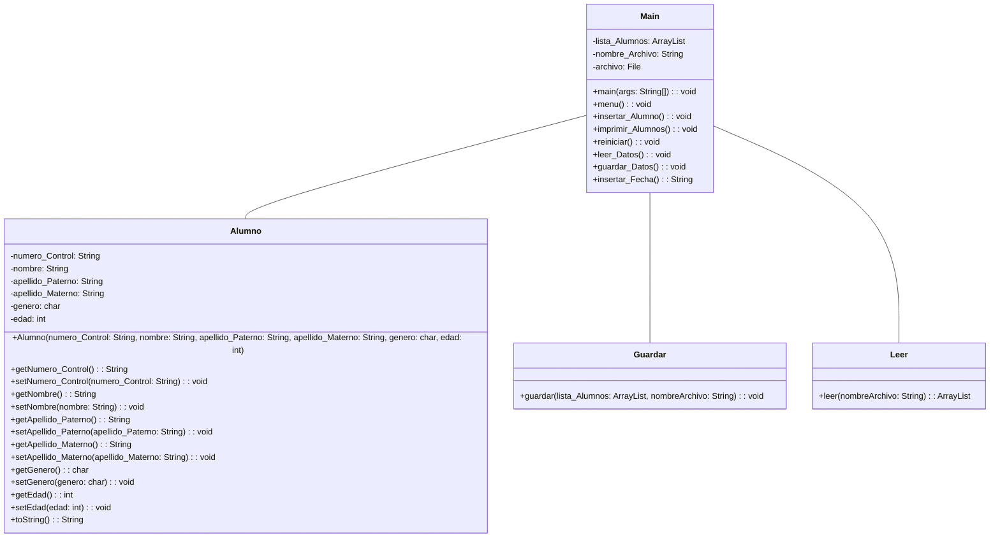

# Programa de Almacenamiento de información de Alumnos

- Jesús Ángel Martínez Mendoza
- Jennifer Diego García
---
Hacer un programa donde se solicite estudiantes.
No utilizar `Scanner` usar `JPane`

- $n$ alumnos hasta salirse
- Almacenar en un archivo de texto `.txt` con las siguiente propiedades
	- Separadas por `,`
	- Un renglón por alumno `Adelina, Martinez, Nieto, 20`
	- Guardar el archivo con un nombre en específico `AlumnosSistemas.txt`
	>Guardar en un `arreglo` o `arrayList` y de ahí exportar
- Imprimir nuestro `arreglo`, todos los alumnos que se van a guardar.
- Propiedades de la clase `Alumno`
	1.  `NumeroControl`
	2.  `Nombre`
	3.  `ApellidoPaterno`
	4.  `ApellidoMaterno`
	5.  `Genero : char`
	6.  `Edad : int`
- Agregar la `fecha` y la `hora` de inserción de datos por lo que el nombre se va a llamar `ArchivosSistemasFecha.txt`

**Objetivos:**
- Manejar objetos
- Ciclos
- Arreglos o `ArrayList`

---

## Diagrama UML

## API 
del Programa
### Alumno

#### Descripción
La clase `Alumno` representa la información de un estudiante, incluyendo su número de control, nombre, apellidos, género y edad.

#### Campos
| Tipo | Campo | Descripción |
|------|-------|-------------|
| `String` | `numero_Control` | Número de control del alumno. |
| `String` | `nombre` | Nombre del alumno. |
| `String` | `apellido_Paterno` | Apellido paterno del alumno. |
| `String` | `apellido_Materno` | Apellido materno del alumno. |
| `char`   | `genero` | Género del alumno. |
| `int`    | `edad` | Edad del alumno. |

#### Constructores
| Constructor | Descripción |
|-------------|-------------|
| `Alumno(String numero_Control, String nombre, String apellido_Paterno, String apellido_Materno, char genero, int edad)` | Crea una instancia de la clase `Alumno` con la información proporcionada. |

#### Métodos
| Nombre | Tipo de Dato que Retorna | Tipo de dato que recibe | Descripción |
|--------|---------------------------|-------------------------|-------------|
| `getNumero_Control()` | `String` | - | Devuelve el número de control del alumno. |
| `setNumero_Control(String numero_Control)` | `void` | `String numero_Control` | Establece el número de control del alumno. |
| `getNombre()` | `String` | - | Devuelve el nombre del alumno. |
| `setNombre(String nombre)` | `void` | `String nombre` | Establece el nombre del alumno. |
| `getApellido_Paterno()` | `String` | - | Devuelve el apellido paterno del alumno. |
| `setApellido_Paterno(String apellido_Paterno)` | `void` | `String apellido_Paterno` | Establece el apellido paterno del alumno. |
| `getApellido_Materno()` | `String` | - | Devuelve el apellido materno del alumno. |
| `setApellido_Materno(String apellido_Materno)` | `void` | `String apellido_Materno` | Establece el apellido materno del alumno. |
| `getGenero()` | `char` | - | Devuelve el género del alumno. |
| `setGenero(char genero)` | `void` | `char genero` | Establece el género del alumno. |
| `getEdad()` | `int` | - | Devuelve la edad del alumno. |
| `setEdad(int edad)` | `void` | `int edad` | Establece la edad del alumno. |
| `toString()` | `String` | - | Devuelve una representación en cadena del objeto alumno. |

### Guardar

#### Descripción
La clase `Guardar` proporciona métodos para guardar datos en un archivo. En este caso, se enfoca en guardar una lista de cadenas en un archivo de texto.

#### Métodos
| Nombre | Tipo de Dato que Retorna | Tipo de dato que recibe | Descripción |
|--------|---------------------------|-------------------------|-------------|
| `guardar(ArrayList<String> lista_Alumnos, String nombreArchivo)` | `void` | `ArrayList<String> lista_Alumnos`, `String nombreArchivo` | Guarda los elementos de la lista en un archivo de texto especificado. |

### Leer

#### Descripción
La clase `Leer` proporciona métodos para leer datos desde un archivo. En este caso, se enfoca en leer líneas de un archivo de texto y almacenarlas en una lista.

#### Métodos
| Nombre | Tipo de Dato que Retorna | Tipo de dato que recibe | Descripción |
|--------|---------------------------|-------------------------|-------------|
| `leer(String nombreArchivo)` | `ArrayList<String>` | `String nombreArchivo` | Lee las líneas de un archivo de texto especificado y las devuelve como una lista de cadenas. |

### Main

#### Descripción
La clase `Main` representa la aplicación principal de registro de alumnos. Proporciona funciones para crear, abrir, y manipular archivos de datos, así como también la capacidad de insertar, leer, guardar, imprimir y reiniciar datos de alumnos.

#### Campos
| Tipo | Campo | Descripción |
|------|-------|-------------|
| `ArrayList<Alumno>` | `lista_Alumnos` | Lista que almacena objetos de la clase `Alumno`. |
| `String` | `nombre_Archivo` | Nombre del archivo que se está manipulando. |
| `File` | `archivo` | Archivo que se está manipulando. |

#### Métodos
| Nombre | Tipo de Dato que Retorna | Tipo de dato que recibe | Descripción |
|--------|---------------------------|-------------------------|-------------|
| `main(String[] args)` | `void` | `String[] args` | Método principal que inicia la ejecución del programa. Permite al usuario crear un nuevo archivo o abrir uno existente. |
| `menu()` | `void` | Ninguno | Muestra un menú interactivo para realizar diversas operaciones en el programa, como insertar alumnos, leer y guardar datos, imprimir la lista de alumnos y reiniciar datos. |
| `insertar_Alumno()` | `void` | Ninguno | Inserta un nuevo alumno en la lista de alumnos. Los datos del alumno se obtienen mediante cuadros de diálogo interactivos. |
| `imprimir_Alumnos()` | `void` | Ninguno | Imprime en un cuadro de diálogo la información detallada de todos los alumnos registrados. |
| `reiniciar()` | `void` | Ninguno | Elimina todos los datos de la lista de alumnos. |
| `leer_Datos()` | `void` | Ninguno | Lee datos desde un archivo existente y los carga en la lista de alumnos. |
| `guardar_Datos()` | `void` | Ninguno | Guarda los datos de la lista de alumnos en el archivo actual. |
| `insertar_Fecha()` | `String` | Ninguno | Genera y devuelve la fecha y hora actual formateada como "dd.MM.yyyy_HH.mm". |
